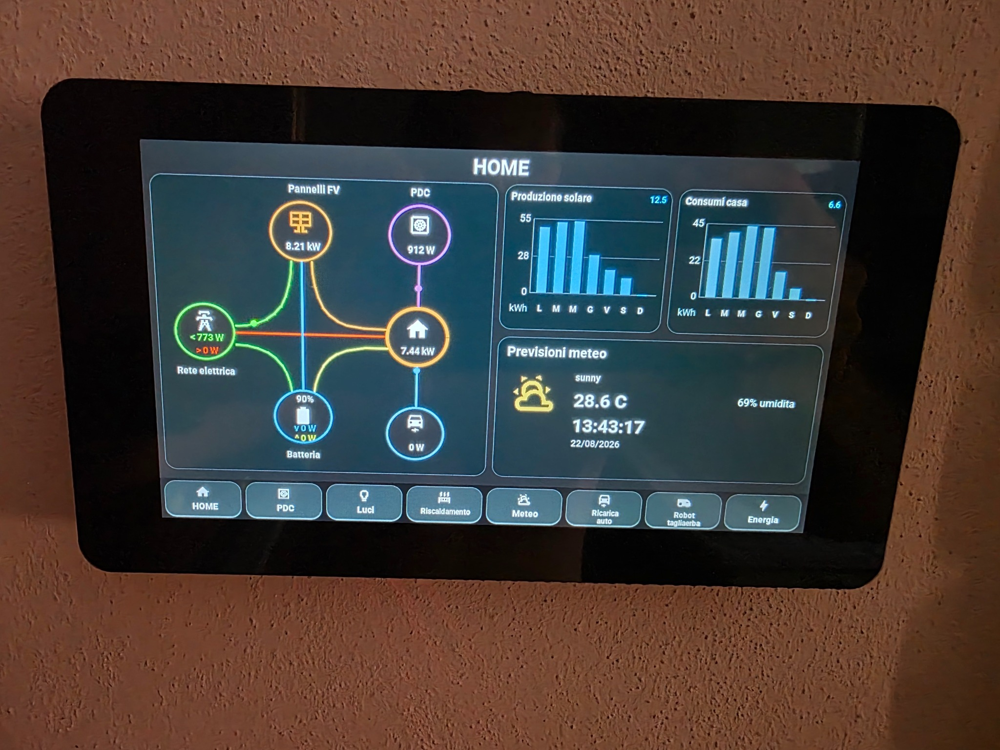
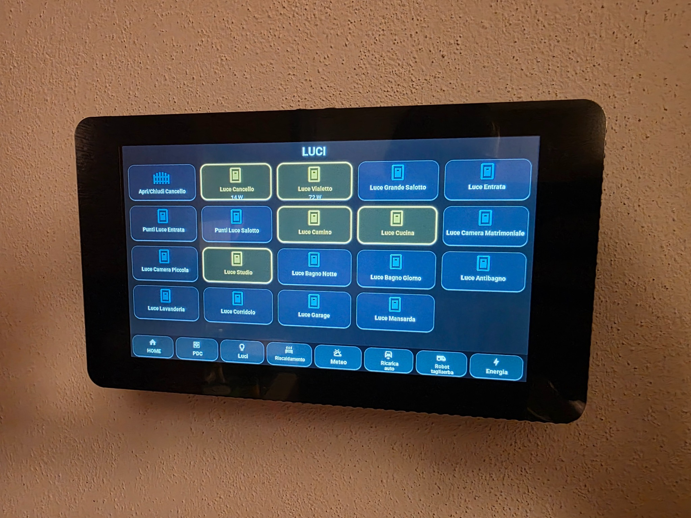
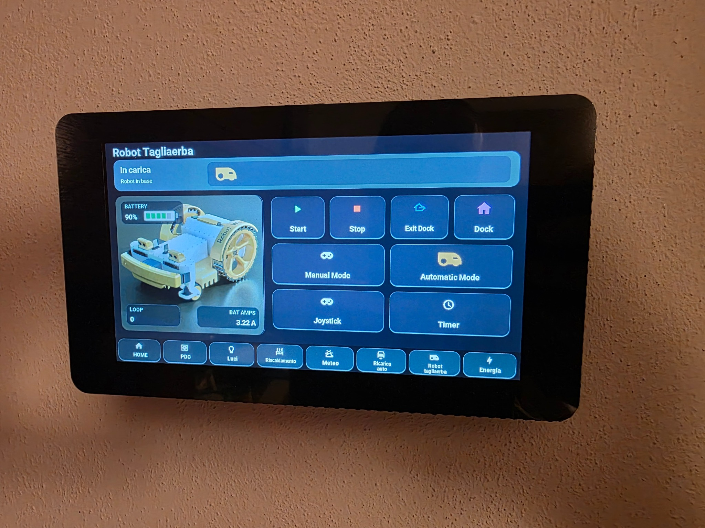
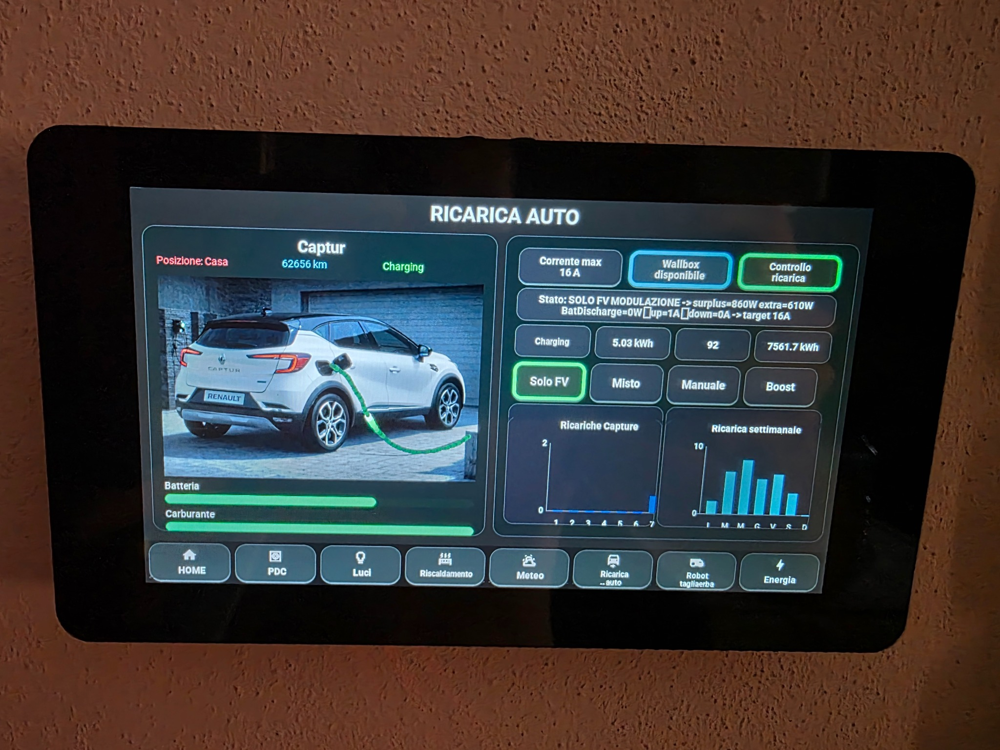
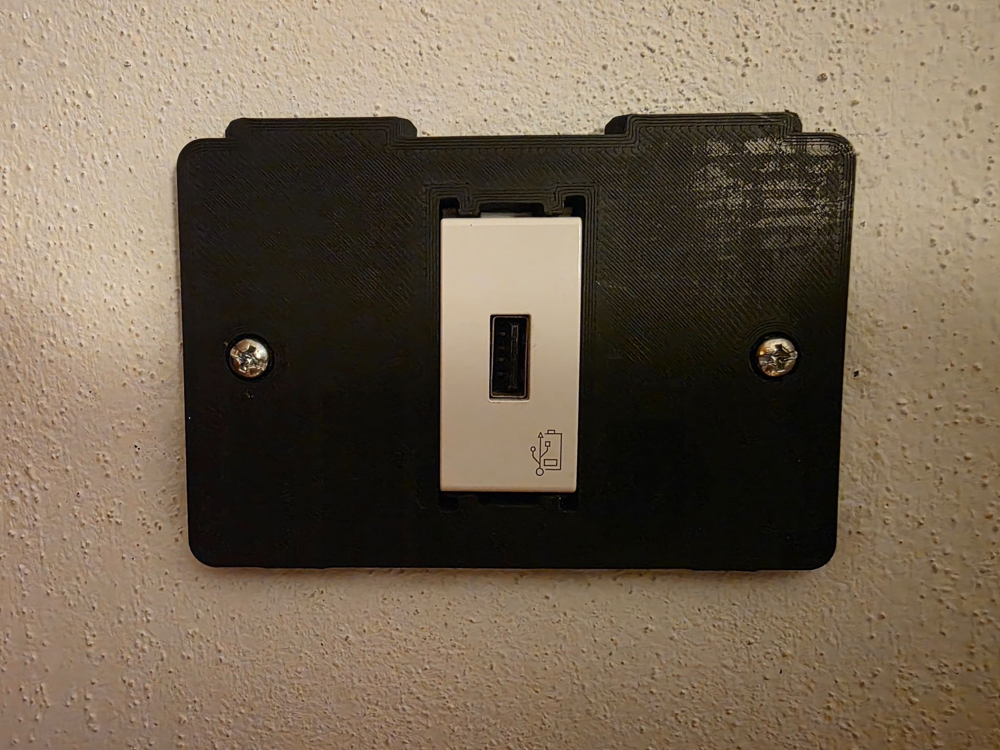
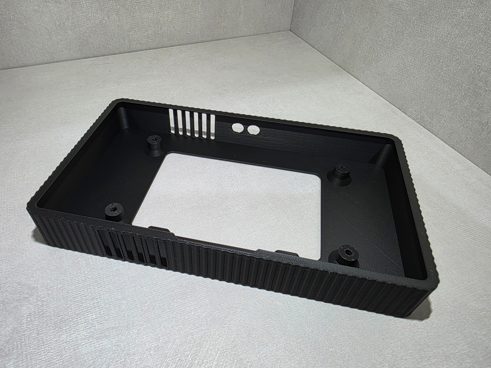
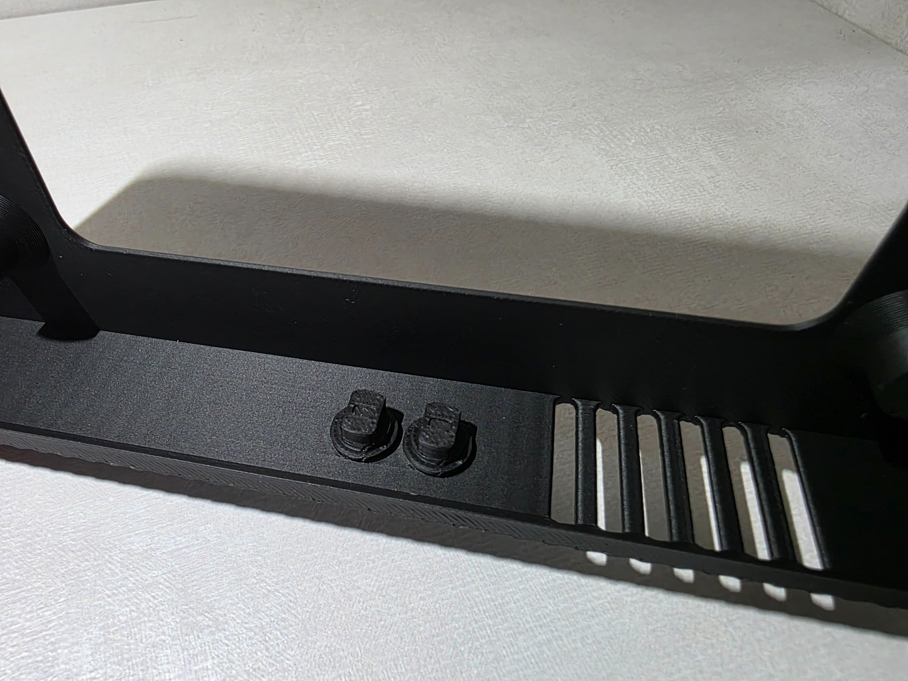
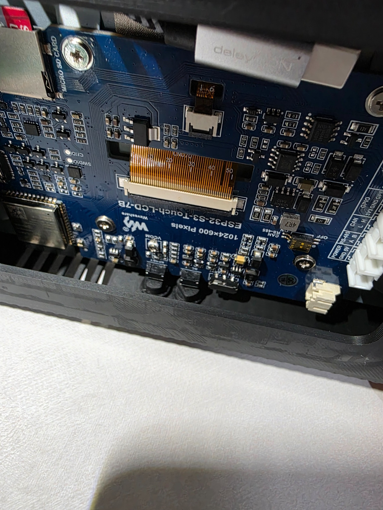

# Waveshare ESPHome Home Assistant Dashboard

Touchscreen wall dashboard for **Home Assistant** based on the **Waveshare ESP32-S3 Touch LCD 7B (1024×600)** and **ESPHome**.

**Stable release: v1.1.1**  
**Development branch: v1.2.0**



## Features

- Home energy distribution with animated power-flow visualization
- Solar production and home-consumption charts
- Heat-pump monitoring page
- Lighting control
- Room heating controls
- Weather page and forecast helpers
- EV charging dashboard
- Robot lawnmower dashboard and controls
- Configurable robot MQTT topics
- Capacitive touchscreen navigation
- microSD logging support
- Native Home Assistant integration through ESPHome
- Dashboard version shown directly on the ESPHome device page
- Optional GitHub release checker with Home Assistant update notifications

## Hardware

The project is designed for the **Waveshare ESP32-S3 Touch LCD 7B**, 7-inch 1024×600 capacitive touchscreen.

A custom 3D-printed enclosure and wall mounting system is available on MakerWorld:

**MakerWorld:**  
https://makerworld.com/it/models/3204446-cover-display-waveshare-7-pollici#profileId-3626631

The enclosure provides:

- wall mounting on a standard 503 box;
- integration with a Vimar Plana USB power module;
- hidden USB cable routing;
- external access to RESET and BOOT;
- ventilation openings.

## Dashboard examples

### Home


### Lights


### Robot lawnmower


### EV charging


## Repository structure

```text
esphome/
  dashboard-package.yaml
  waveshare-display.example.yaml
  user_config.example.yaml
  secrets.example.yaml
  sd_storage.h
  Robot.jpg
  capture_card.png
  waveshare-dashboard.yaml        # legacy/reference v1.0 configuration

home-assistant/
  display_weather.yaml
  home_assistant_display.yaml
  dashboard_update.yaml           # update checker from v1.2.0
  CONFIGURATION.md

docs/
  images/
```

## v1.2.0 configuration model

Starting with v1.2.0, the dashboard release is controlled by a single value in the local hidden ESPHome file `.user_config.yaml`:

```yaml
dashboard_version: "v1.2.0"
```

That value is used for two purposes:

1. it selects the matching GitHub package release through `packages.dashboard.ref`;
2. it is exposed by ESPHome as the dashboard-version sensor in Home Assistant.

This prevents the installed package version and the version reported to Home Assistant from drifting apart.

To update to a future release, change only `dashboard_version` to the new release tag and reinstall the display from ESPHome.

## Quick start

### 1. Prepare the local ESPHome files

From the `esphome/` directory, keep these files in your ESPHome configuration directory:

```text
waveshare-display.yaml
.user_config.yaml
sd_storage.h
Robot.jpg
capture_card.png
```

Create the first two files as follows:

```text
waveshare-display.example.yaml -> waveshare-display.yaml
user_config.example.yaml       -> .user_config.yaml
```

The leading dot in `.user_config.yaml` is intentional. ESPHome Device Builder hides dot-prefixed YAML files, so this substitutions file does not appear as a false offline device card.

`dashboard-package.yaml` does **not** need to be copied locally. It is loaded remotely from the GitHub release selected by `dashboard_version`.

The files `sd_storage.h`, `Robot.jpg`, and `capture_card.png` remain local because the ESPHome configuration references them as local include/image assets.

### 2. Configure your entities

Open:

```text
.user_config.yaml
```

Change only the values on the right side of the keys. This file contains the installation-specific Home Assistant entities for energy, heat pump, lights, heating, weather, EV charging and robot lawnmower data.

Do not rename:

```yaml
dashboard_version: "v1.2.0"
```

The robot command topics are also configurable:

```yaml
robot_mqtt_control_topic: "home/robot/mower/control"
robot_mqtt_timers_topic: "home/robot/mower/control/timers"
robot_mqtt_joystick_topic: "home/robot/mower/control/joystick"
```

### 3. Configure ESPHome secrets

Use `esphome/secrets.example.yaml` as a reference and add these keys to your normal ESPHome `secrets.yaml`:

```yaml
wifi_ssid: "YOUR_WIFI_SSID"
wifi_password: "YOUR_WIFI_PASSWORD"
waveshare_display_encryption_key: "YOUR_ESPHOME_API_ENCRYPTION_KEY"
waveshare_display_ap_password: "YOUR_FALLBACK_AP_PASSWORD"
```

Do not publish your real `secrets.yaml`.

### 4. Install the Home Assistant helper packages

The dashboard uses helper entities generated by:

- `home-assistant/display_weather.yaml`
- `home-assistant/home_assistant_display.yaml`

From v1.2.0, the optional but recommended update checker is:

- `home-assistant/dashboard_update.yaml`

Before using the Home Assistant packages, read:

**`home-assistant/CONFIGURATION.md`**

The generated `sensor.display_*` entity IDs are intentionally kept stable because the ESP32 dashboard reads those helper names directly.

### 5. Automatic update notification

`dashboard_update.yaml` checks the latest stable GitHub release every 6 hours.

The installed version is discovered automatically from the ESPHome dashboard-version entity. This works even if Home Assistant prefixes the entity ID with the area or device name.

The package creates stable helper entities including:

```text
sensor.waveshare_dashboard_installed_version
sensor.waveshare_dashboard_latest_version
binary_sensor.waveshare_dashboard_update_available
```

If a newer stable release exists, Home Assistant creates a persistent notification containing:

- installed version;
- latest version;
- direct link to the GitHub release.

The checker **never installs firmware automatically**. Updating remains manual by design.

After adding `dashboard_update.yaml` for the first time, perform a **full Home Assistant restart**. Reloading YAML alone may not create the REST sensor.

### 6. Allow Home Assistant actions

In Home Assistant open:

**Settings → Devices & services → ESPHome → waveshare-display → Configure**

and enable:

**Allow the device to perform Home Assistant actions**

### 7. Validate and install

After configuring `.user_config.yaml`, the secrets and the Home Assistant helper packages:

1. validate the ESPHome configuration;
2. compile it;
3. install it on the Waveshare ESP32-S3 Touch LCD 7B;
4. confirm the device connects to Home Assistant;
5. confirm `Waveshare Dashboard Version` is visible on the ESPHome device page;
6. confirm the update-checker entities are available if `dashboard_update.yaml` is installed.

## Home Assistant helper packages

The helper packages create the historical/weather `sensor.display_*` entities required by the graphs and forecast page. Their source entity IDs are not universal, so they must be adapted to each Home Assistant installation.

See:

```text
home-assistant/CONFIGURATION.md
```

for the exact mapping and requirements.

## microSD

`sd_storage.h` mounts the onboard microSD and can write:

```text
/sdcard/waveshare/display.log
/sdcard/waveshare/energy_history.csv
```

The energy history CSV includes:

```text
timestamp,solar_w,grid_w,battery_w,home_w,pdc_w,battery_soc_pct
```

The display continues to operate if the microSD is not available; logging is simply unavailable.

## 3D printed enclosure









## Versioning

- `v1.0.x` — bug fixes to the initial public version
- `v1.x.0` — backward-compatible features and configuration improvements
- `v2.0.0` — major/incompatible changes

v1.1.x has been validated, compiled and tested successfully on the real Waveshare ESP32-S3 Touch LCD 7B hardware. v1.2.0 development has also been tested on the real display for version reporting and Home Assistant update notifications.

## Related project

Robot Arduino 4.0:  
https://github.com/Marcobedendo78/Robot-Arduino-4.0

## Author

Marco Bedendo — `Marcobedendo78`
